# Mixologia — Case Study (iOS)

> Freemium iOS cocktail app built with SwiftUI. The codebase is private (App Store release), but this repo documents product scope, architecture, and demo materials.

**Quick facts:** 300+ recipes • 11 languages • Advanced search • OpenAI-powered AI Builder • RevenueCat subscriptions • Firebase + CloudKit

## Snapshot
- 300+ global recipes with rich metadata (ABV, calories, tags, substitutions, i18n steps)
- 11 languages (EN, TR, IT, KO, JA, FR, ES, PT-BR, DE, zh-Hans, zh-HK)
- Advanced search (name / ingredients / tags / keywords)
- AI Builder: user freely types any ingredients/flavors → generates 2–3 unique cocktail ideas per prompt (OpenAI API, GPT-4o mini)
- My Bar inventory & “missing ingredients” UX
- Shopping List + share flow (e.g., WhatsApp)
- Curated Collections

## Tech Stack
- iOS: Swift, SwiftUI
- Backend/Content: Firebase (Firestore, Storage, Remote Config)
- User Data Sync: CloudKit
- Monetization: RevenueCat (weekly / monthly / annual)
- AI: OpenAI API (GPT-4o mini)

## Monetization (Freemium)
**Free**
- Recipe browsing

**Premium**
- Collections
- Shopping List
- My Recipes beyond 1
- Favorites beyond 3
- AI Builder after 1 use

## Status
- ✅ Internal TestFlight is live
- ⏳ External TestFlight review pending
- 🚀 App Store 1.0 release in progress

## Privacy & Data
- Content and media are managed via Firebase (Firestore/Storage/Remote Config).
- User data sync is handled via CloudKit.
- AI Builder uses OpenAI API (GPT-4o mini).
- Source code is private due to commercial release plans; this repo focuses on product/engineering scope.

## Screenshots

  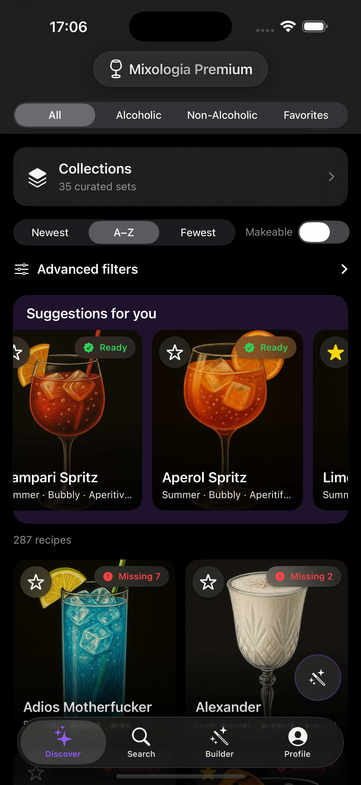
  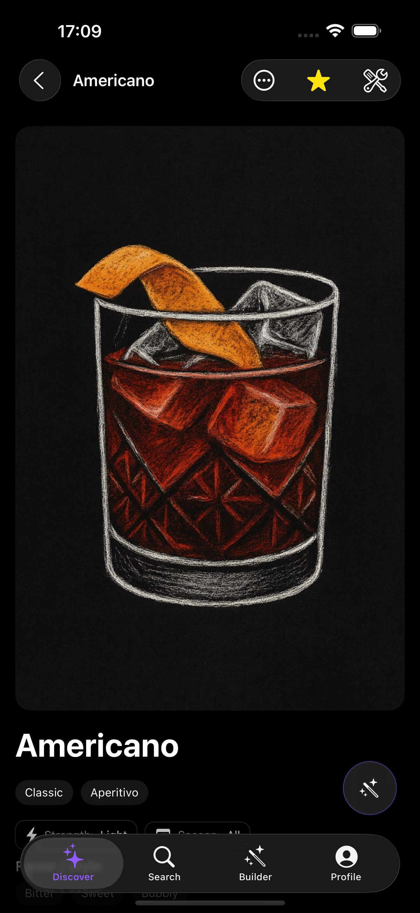
  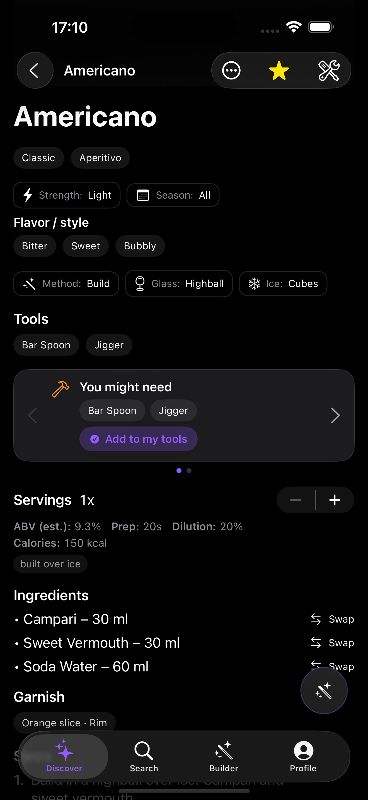

  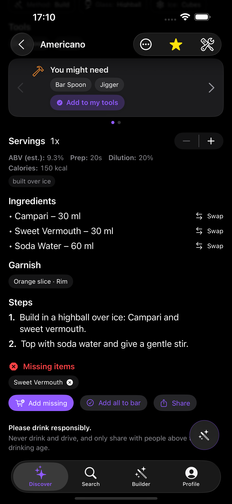
  
  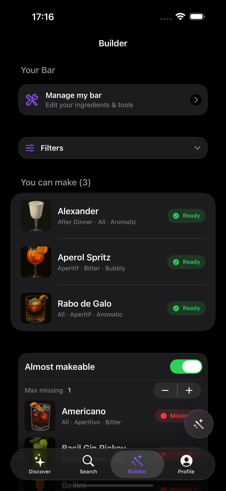

  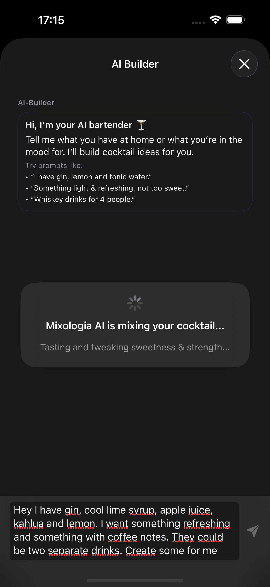
  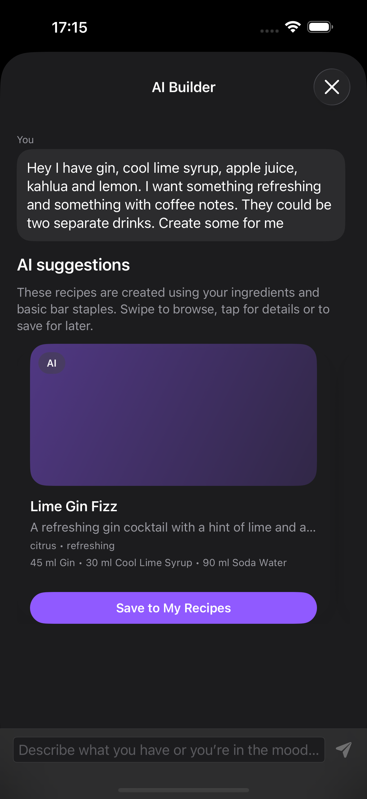
  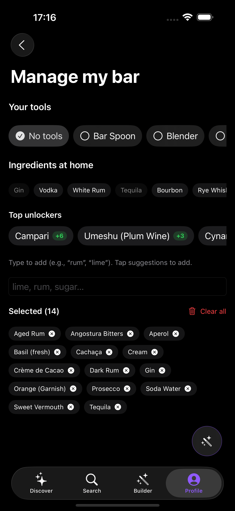

  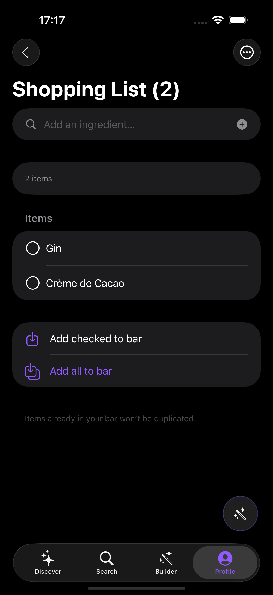
  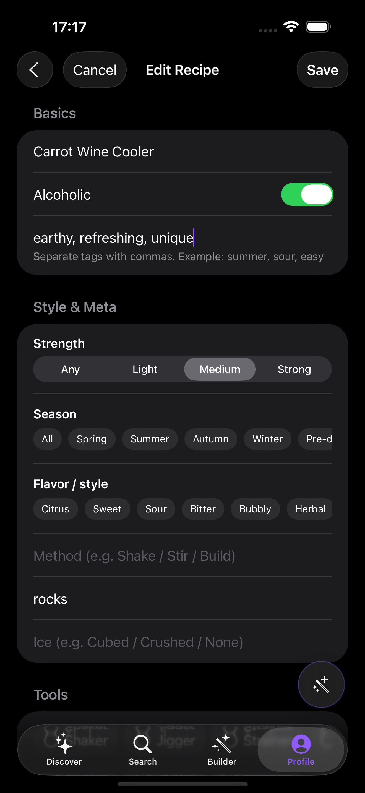
  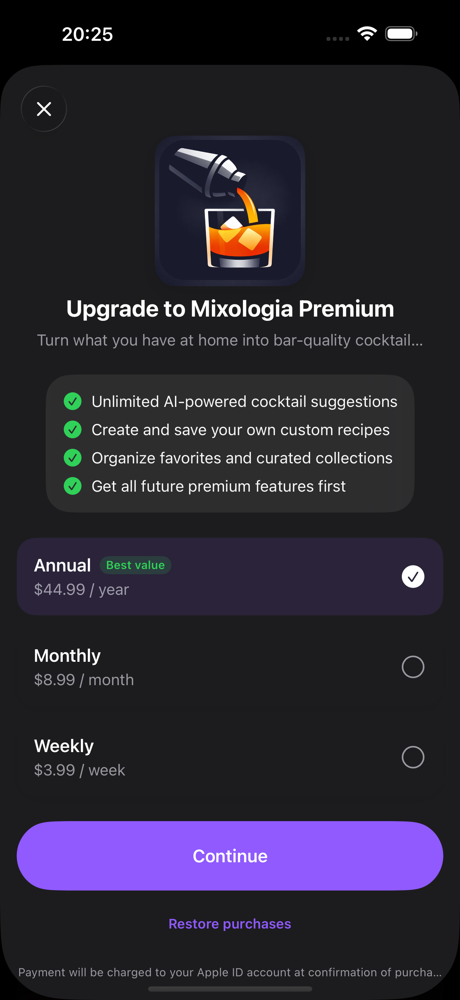

## Demo
TestFlight demo available upon request.

## Contact
- GitHub: https://github.com/kaanbtn
- LinkedIn: https://www.linkedin.com/in/kaanbutunley
